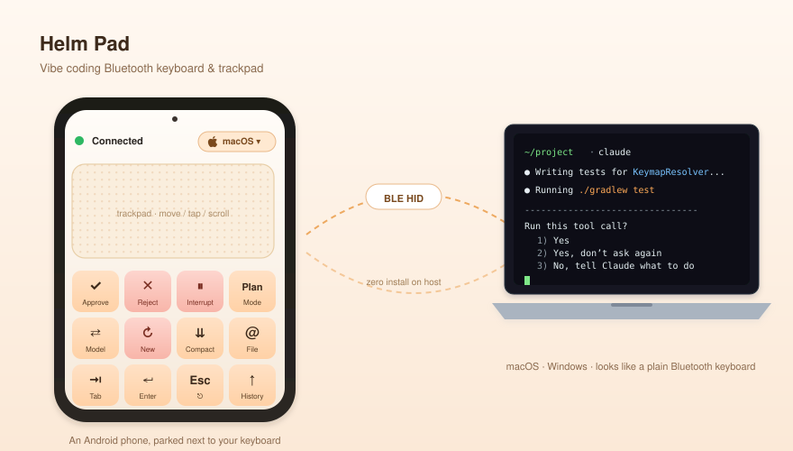
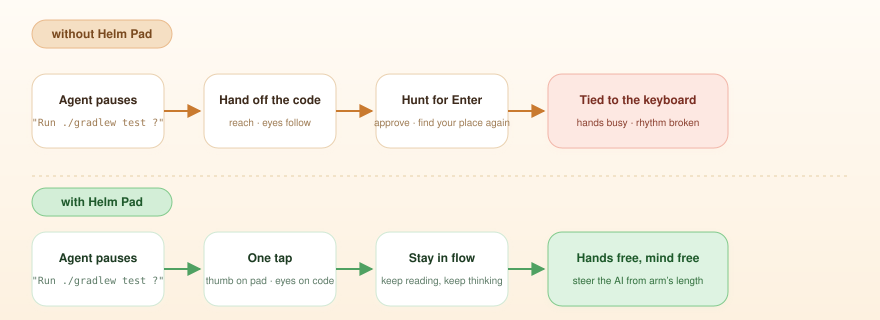

English · [中文](README.zh.md)

# Helm Pad

> Turn the Android phone/pad in your hand into a small Bluetooth keyboard and trackpad that sits next to your laptop, so you can keep nudging an AI coding agent without leaving your seat — or your coffee.

  

## Why I built it

I do most of my coding by pair-programming with an AI agent in a terminal. The agent does the typing; my job is mostly to keep nudging it — *yes, run that*, *no, try again*, *Esc, redo*, *switch model*, *new session*. Tiny inputs, but a lot of them.

What started to bother me wasn't the work, it was the posture. Every nudge pulled a hand off the keyboard or my eyes off the diff. And when I leaned back with a coffee while the agent was grinding on something long, the moment it paused I had to put the cup down, sit up, find the cursor, click — the break was gone before it started.

So I made a small Bluetooth keyboard + trackpad that runs on the phone I was already holding.

## What it does

To the laptop it just looks like a regular Bluetooth keyboard and mouse — no companion app, no driver, no permissions dance. On the phone:

- Eight macros in two rows: **Approve · Esc · Cycle mode · ↑** and **Switch model · New session · Compact · ↓**. The ones I actually press most during an agent loop.
- The rest of the screen is a real trackpad — single-finger move and tap, two-finger scroll, two-finger tap for right-click, long-press to drag.
- It auto-detects whether the phone is paired to a Mac or to Windows and picks the matching modifier key (Cmd vs. Ctrl), so the same phone works on either machine without me thinking about it.

  

The use I keep coming back to: agent is running, I'm leaning back with the phone in one hand and a coffee in the other, half-scrolling something else. It pauses for input, I thumb *Approve*, leaning stays leaning. The break stays a break.

## Trying it

You'll need an Android 9+ phone and a Mac or Windows machine.

1. Grab the latest APK from Releases and install it.
2. From your laptop's Bluetooth settings, pair the phone like any other keyboard.
3. Open Helm Pad and follow the on-screen setup once.

It works fine on the phone you carry day to day. It also works fine on a spare phone you keep on the desk, if you'd rather not mix it with personal use. There's nothing to install on the laptop side.

## Licence

Not chosen yet. I'll pick one before tagging a stable release.
